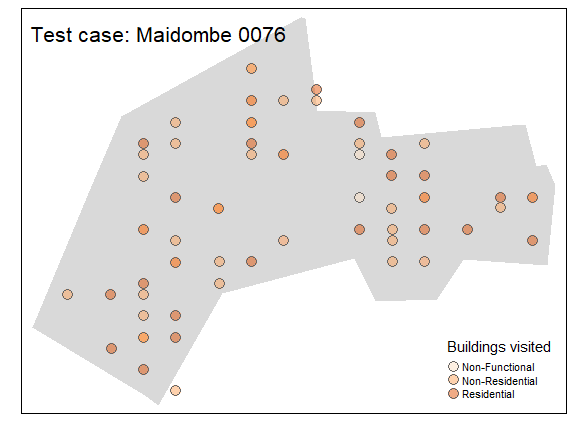

# Code for DRC project

## Section 1: how we've proceeded

###### Step 1 Handling SpatialPolygone object
- drop kinshasa
- merge three Bandundu's regions

###### Step 2 Dealing with the census

- merge census (residential/non-residential)
- add cluster's attributes to points 
  - first spatial merge (80557 points attributed)
  - second classic df merge (+2136 points attributed)

## Section 2: what is the output

After the two merges, 365 data points remain without any clusters information because of naming issue in the variable `cluster_id` in the census data
It corresponds to 20 clusters unidentified:

```
 cluster_id     
 [1] "0"               "1"               "102"             "11"              "124"             "129"            
 [7] "167"             "19"              "2"               "243"             "3"               "4"              
[13] "5"               "528"             "56"              "58"              "6"               "7"              
[19] "8"               "drc_kwango_0000"
`````

### Section 3: Check for micro-census coverage


###### Drawing buffer around observations

**Idea:** GPS points are not completely exact. We add a relative incertitute to data by drawing a buffer around each points.

**Procedure:**
- transform CRS data ( we use UTM coding with zone = 34 what corresponds to Bandundu in DRC)
- draw a buffer of XXm around it.
- study the sensitivty of the result to this parameter.


###### Compute the proportion of covered area
