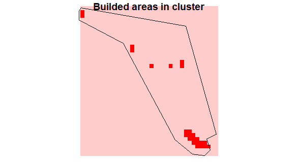

# Code for DRC project

## Section 1: Setting the input

#### Data cleaning

###### Step 1 Handling SpatialPolygone object
- drop kinshasa
- merge three Bandundu's regions

###### Step 2 Dealing with the census

- merge census (residential/non-residential)
- add cluster's attributes to points 
  - first spatial merge (80557 points attributed)
  - second classic df merge (+2136 points attributed)

#### First analyses

###### Missing cluster ID
After the two merges, 365 data points remain without any clusters information because of naming issue in the variable `cluster_id` in the census data
It corresponds to 20 clusters unidentified:

```
 cluster_id     
 [1] "0"               "1"               "102"             "11"              "124"             "129"            
 [7] "167"             "19"              "2"               "243"             "3"               "4"              
[13] "5"               "528"             "56"              "58"              "6"               "7"              
[19] "8"               "drc_kwango_0000"
`````

###### Missing census observations

In some clusters (118 out of 528), mostly in Kinshasa, we don't have corresponding census observations. What happened? Is that normal that surveyors haven't carried on the survey in these areas?

```
[1] drc_kinshasa_0091  drc_kwilu_0199     drc_kinshasa_0092  drc_kinshasa_0093 
  [5] drc_kinshasa_0094  drc_kinshasa_0095  drc_kinshasa_0096  drc_kinshasa_0097 
  [9] drc_kinshasa_0098  drc_kinshasa_0099  drc_kinshasa_0100  drc_kinshasa_0101 
 [13] drc_kinshasa_0102  drc_kinshasa_0103  drc_kinshasa_0104  drc_kinshasa_0105 
 [17] drc_kinshasa_0106  drc_kinshasa_0107  drc_kinshasa_0001  drc_kinshasa_0002 
 [21] drc_kinshasa_0003  drc_kinshasa_0004  drc_kinshasa_0005  drc_kinshasa_0006 
 [25] drc_kinshasa_0007  drc_kwilu_0043     drc_kinshasa_0008  drc_kinshasa_0009 
 [29] drc_kinshasa_0010  drc_kinshasa_0011  drc_kinshasa_0012  drc_kinshasa_0013 
 [33] drc_kinshasa_0014  drc_kinshasa_0015  drc_kinshasa_0016  drc_kinshasa_0017 
 [37] drc_kinshasa_0018  drc_kinshasa_0019  drc_kinshasa_0020  drc_kinshasa_0021 
 [41] drc_kinshasa_0022  drc_kinshasa_0023  drc_kinshasa_0024  drc_kinshasa_0025 
 [45] drc_kinshasa_0026  drc_kinshasa_0027  drc_kinshasa_0028  drc_kinshasa_0029 
 [49] drc_kinshasa_0030  drc_kinshasa_0031  drc_kinshasa_0032  drc_kinshasa_0033 
 [53] drc_kinshasa_0034  drc_kinshasa_0035  drc_kinshasa_0036  drc_kinshasa_0037 
 [57] drc_kinshasa_0038  drc_kinshasa_0039  drc_kinshasa_0040  drc_kinshasa_0041 
 [61] drc_kinshasa_0042  drc_kinshasa_0043  drc_kinshasa_0044  drc_kinshasa_0045 
 [65] drc_kinshasa_0046  drc_kinshasa_0047  drc_kinshasa_0048  drc_kinshasa_0049 
 [69] drc_kinshasa_0050  drc_kinshasa_0051  drc_kinshasa_0052  drc_kwilu_0070    
 [73] drc_kinshasa_0053  drc_kinshasa_0054  drc_kinshasa_0055  drc_kinshasa_0056 
 [77] drc_kinshasa_0057  drc_kinshasa_0058  drc_kinshasa_0059  drc_kinshasa_0060 
 [81] drc_kwilu_0076     drc_kinshasa_0061  drc_kinshasa_0062  drc_kinshasa_0063 
 [85] drc_kinshasa_0064  drc_kinshasa_0065  drc_kinshasa_0066  drc_kinshasa_0067 
 [89] drc_kinshasa_0068  drc_kinshasa_0069  drc_kinshasa_0070  drc_kinshasa_0071 
 [93] drc_kinshasa_0072  drc_kinshasa_0073  drc_kinshasa_0074  drc_kinshasa_0075 
 [97] drc_kinshasa_0076  drc_kinshasa_0077  drc_kinshasa_0078  drc_kwilu_0089    
[101] drc_kwilu_0090     drc_kinshasa_0079  drc_kinshasa_0080  drc_kinshasa_0081 
[105] drc_kinshasa_0082  drc_kinshasa_0083  drc_maindombe_0044 drc_kinshasa_0084 
[109] drc_kinshasa_0085  drc_kwilu_0156     drc_kinshasa_0087  drc_kinshasa_0088 
[113] drc_kinshasa_0089  drc_kinshasa_0090  drc_kwango_0017    drc_kwango_0031   
[117] drc_kwango_0036    drc_kwango_0042   
```

### Section 2: Check for micro-census coverage
**Idea**: we want to know if surveyed areas, ie clusters,  were fully covered by the surveyors, for sampling bias and density computation.


#### Drawing buffer around observations


**Idea:** GPS points are not completely exact. We add a relative incertitute to data by drawing a buffer around each points.

**Procedure:**
- transform CRS data ( we use UTM coding with zone = 34 what corresponds to Bandundu in DRC)
- draw a buffer of XXm around it.
- study the sensitivty of the result to this parameter.


#### Compute the proportion of covered area

##### 1. The denominator

We considered only the builded areas in the cluster, using onrl settlement layer.


And then adding up the pixels in red.

##### 2. The numerator

We overlay the census data buffered and pick only pixels where there is at least one observation.


Proportion results in dividing the pixels surveyed by the pixels in the builded areas.

###### 3. Results
```
   Min. 1st Qu.  Median    Mean 3rd Qu.    Max. 
0.03846 0.83333 1.00000 0.90479 1.00000 1.00000
```


**Sensitivity analyses**

For a buffer of 1 meter | For a buffer of 10 meters
--------------------- | ---------------------------
   Min. 1st Qu.  Median    Mean 3rd Qu.    Max. |  Min. 1st Qu.  Median    Mean 3rd Qu.    Max. 
0.03846 0.80000 1.00000 0.88526 1.00000 1.00000 |0.03846 0.87500 1.00000 0.92118 1.00000 1.00000 
 | 
