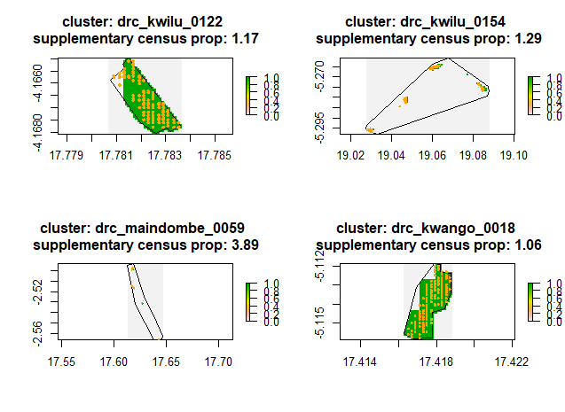
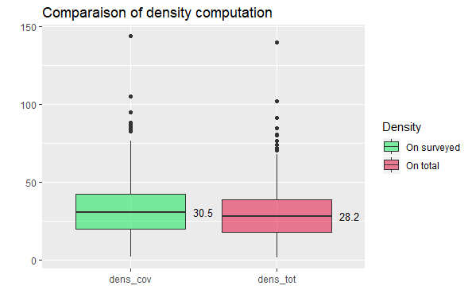
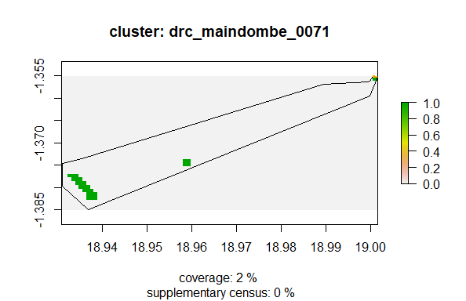

# Assessing accuracy of micro-census data in DRC


## The setting

In this study, we want to tackle 
over and underestimation of population issues
that are coming from:
- settlement areas in cluster that haven't been fully covered by the surveyors
- census observations that are failing out of areas considered as settlement.

The first issue leads us to missing data bias: the observation we get are actually coming from only a part of the area of concern. Neglecting that would yield to underestimate the actual number of people in that cluster by using a smaller numerator than reality to compute the density.
The second ones overestimate the density by considering a smaller built area that in reality.

**Schema and metrics**


## The study

### Coverage issue

**Methodology**: we compute the number of 10x10 cells in the settlement layer that were actually covered by at least a census observation and divide by the total amount of cells belonging to the settlement layer in the cluster 
(NB: we took the greater definition of polygons by using the outwards borders). This defines the metric we called *coverage proportion*.
This metric is really conservative.

**Results**

###### General overview
Map | Histogram
------------ | -------------------
 |   

Proportions:

````
Coverage proportion distribution in 4 classes:
 0%-60%  60%-80%  80%-90% 90%-100% 
       9       34       75      292 
````

**Interpretation** Most of the censuses (367/410) have a coverage that we can consider as acceptable.
Shall we see a geographical pattern on the map? Either because it's more complicated to access this part of Bandundu or because it was covered by a less efficient surveyor.

###### Worst Cases (<60% of coverage - 9 cases)


### Over sampling of building

**Methodology:** We select the 10x10m cells that are covered by at least one census observations. Out of these we sum up the ones that are not considered as belonging to the settlement area. 
We compute two metrics out of this statistic: first the proportion of supplementary surveyed areas which divide the previous stat by the total amount of settlement area in that cluster. 
This depicts thus the supplementary cells surveyed from the one that were targeted. And second coverage accuracy rate that takes into account also the previous bias by dividing our stat by total number of cells actually surveyed.

**Results**

###### General overview
Map | Histogram
------------ | -------------------
 |   

Proportions:

````
Supplementary census proportion distribution in 4 classes:
        0% 0.03%-0.4%    0.4%-1%      1%-3% 
       253         95         52         10 
````
###### Worst case (>1% supplementary area surveyed - 10 cases)




## How to tackle it

#### Coverage issue

Two possibilities:
- either we extrapolate from the census observation we have to the whole cluster
- or we restrict the area to the actual one surveyed to compute the density.


#### Supplementary census issue

We can add as settlement area the cells on which were surveyed the building present in our census.

## In practice

##### Supplementary census


We've decided based on the previous picture that oversampled observation is not a big issue because:
- first, based on the worst cases, we can see that oversampling just appears in a few cases,
- second, it's mainly non-residential buildings that are surveyed outside the area considered as settled.

##### Under coverage

We investigated the difference in computed density, between using as denominator, the full area in settlement layer, or only the one surveyed.

We have in average a difference of 3 people/km^2 with as outlier `drc_maindombe_0071`

